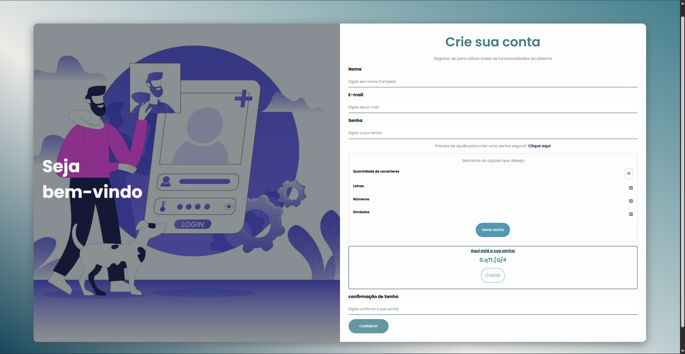

# 🔐 Genpass

Genpass é uma aplicação web de cadastro com gerador de senhas integrado. O usuário pode criar sua conta e, caso precise de ajuda para definir uma senha segura, utilizar o gerador diretamente na tela de registro.

---

## 🖥️ Preview

> __

---

## ✨ Funcionalidades

- 📋 Formulário de cadastro com campos de nome, e-mail, senha e confirmação de senha
- 🔑 Gerador de senhas com opções configuráveis:
  - Quantidade de caracteres
  - Letras (maiúsculas e minúsculas)
  - Números
  - Símbolos
- 📋 Cópia da senha gerada para o clipboard
- 💪 Indicador de força da senha
- 🔔 Toast notification de feedback ao copiar

---

## 🛠️ Tecnologias

- HTML5
- CSS3
- JavaScript (Vanilla)

---

## 🚀 Como rodar

Não requer instalação ou dependências. Basta:

1. Clonar o repositório:
```bash
git clone https://github.com/dnsfer/genpass.git
```

2. Abrir o arquivo `index.html` no navegador.

---

## 📁 Estrutura de pastas

```
genpass/
├── assets/
│   ├── css/
│   │   └── style.css
│   ├── js/
│   │   └── script.js
│   └── image/
├── index.html
└── README.md
```


## 📄 Licença

Este projeto está sob a licença MIT. Veja o arquivo [LICENSE](LICENSE) para mais detalhes.
